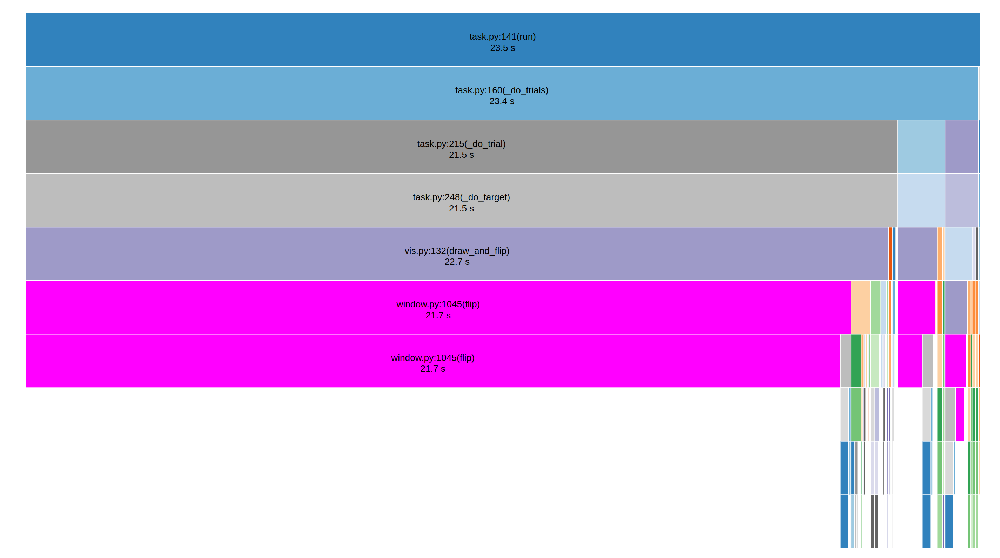

# Benchmarks

A basic script to profile the performance of the task using
[cProfile](https://docs.python.org/3/library/profile.html#module-cProfile)
and [SnakeViz](https://jiffyclub.github.io/snakeviz/).

Run `./profile_task.sh` (on linux) to do a simple task and display the profiling results.

