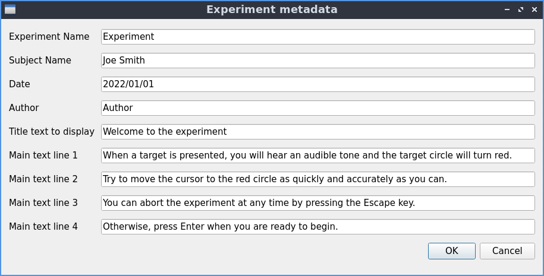
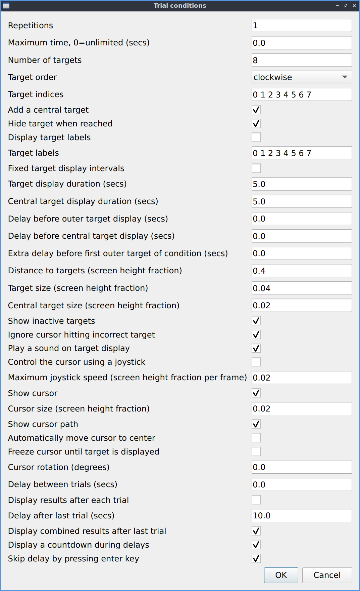
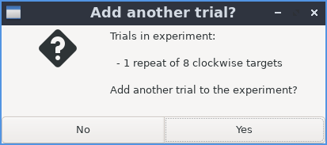

Creating a new experiment
=========================

Start dialog
------------

To create a new experiment, click on "Create and run new experiment", then "OK".

.. figure:: images/start-screen-1.png
   :alt: start dialog

   The options available when you start the program.

Experiment metadata
-------------------

You can then edit the metadata for the experiment,
as well as the text that should be displayed before the experiment begins.
When you are finished, click "OK".

   Dialog to edit the metadata for an experiment

Trial settings
--------------

Next the first trial can be created. When you are finished, click "OK".

   Dialog to edit the settings for a trial

Note on "Target indices"
   * if "Target order" is "fixed" then this lists the targets in the order to be displayed
   * targets are numbered clockwise starting from 0 at the top of the circle
   * note: if "Target order" is not "fixed" these indices are ignored

Add another trial
-----------------

If you would like to add another trial to the experiment, click "Yes".
If you are finished adding trials to the experiment, click "No".

   Dialog listing current trials and offering to add another one

Display options
---------------

The final set of options are what results to display.
When you are finished, click "OK", and the experiment will begin.

.. figure:: images/display-screen.png
   :alt: trial settings dialog

   Dialog to edit the display options for an experiment
