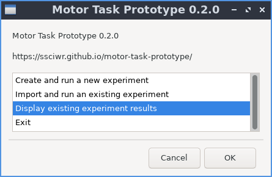
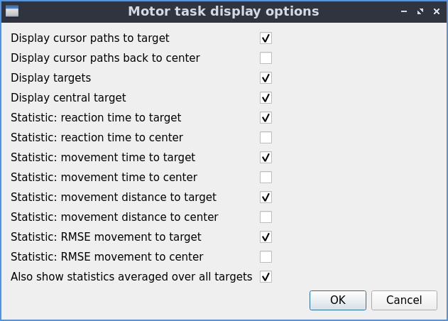

Displaying results
==================

Start dialog
------------

To display the results of a previous experiment, click on "Display existing experiment results", then "OK".

   The options available when you start the program.

Display options
---------------

You can then choose which results and statistics to display.
When you are finished, click "OK".

   Dialog to select which results and statistics to display

Results
-------

The selected results are then displayed.

.. figure:: images/results.png
   :alt: experiment results screen

   An example of results from an experiment.
