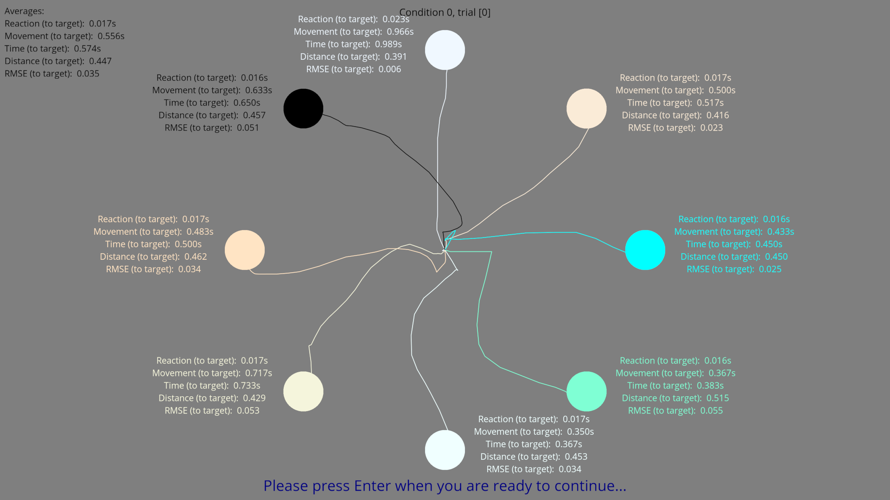

Displaying results
==================

To display the results from a trial, select it from the list and click "Display Trial".
You can also display all the trials with the same conditions with "Display Condition".

   Results: a list of trials which can be displayed.

Display options
---------------

You can choose which results and statistics to display in the Display Options section.

   Display Options: select which results and statistics to display.

Results
-------

The selected results are then displayed.

   An example of results from an experiment.
