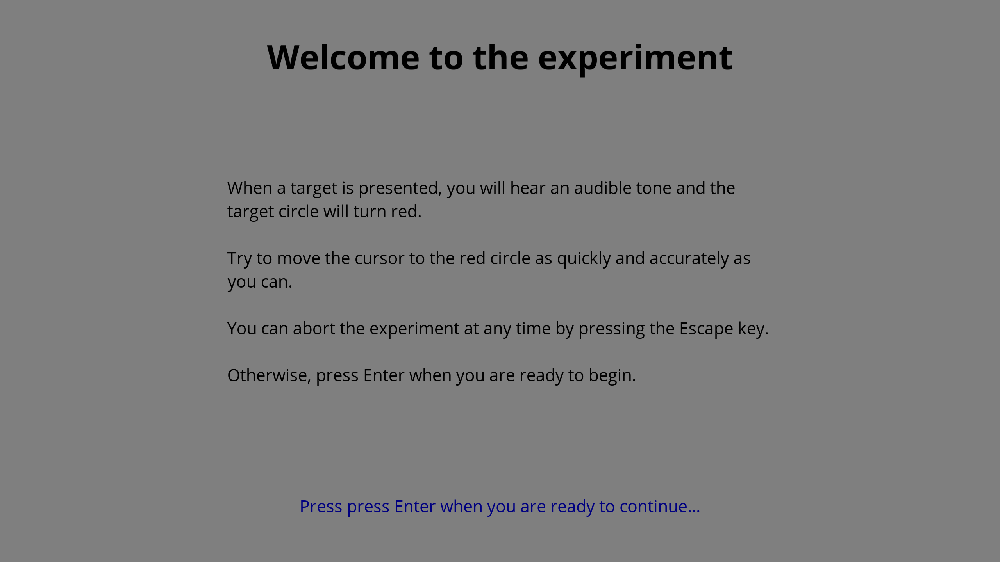
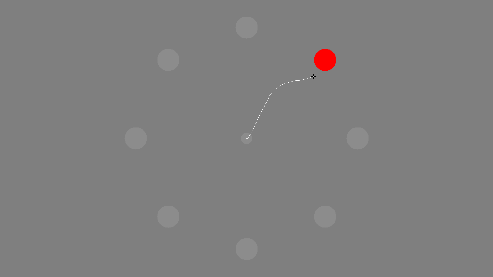

Running an experiment
=====================

To run an experiment, got to Experiment -> Run, or press ``Ctrl+R``, or click on the circular green toolbar button

Splash screen
-------------

The experiment will then start, first displaying the splash screen.

   An example of an experiment splash screen displayed before the experiment begins.

Trials
------

Next come the trials.

   An example of a trial in progress during an experiment.

Results
-------

Depending on the trial settings, results may be displayed after a trial or block of trials.

.. figure:: images/results.png
   :alt: experiment results screen

   An example of a results display after a block of trials during an experiment.
