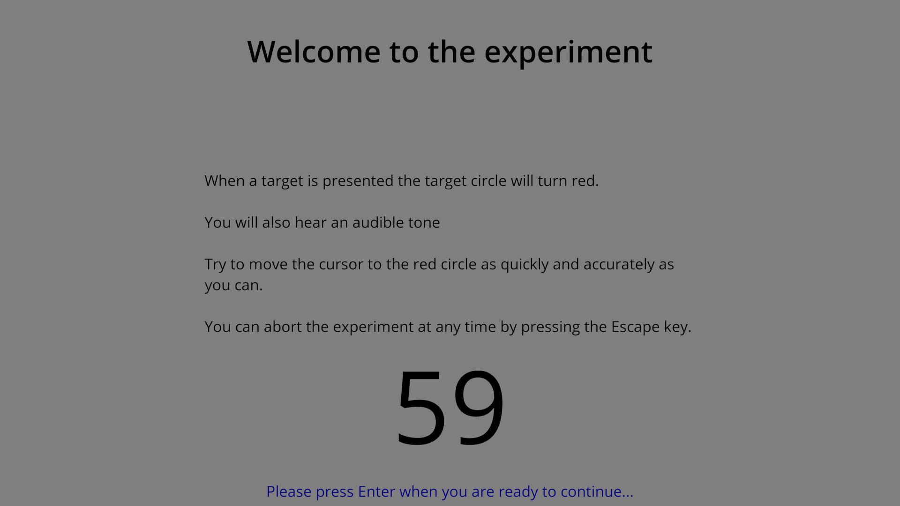

Running an existing experiment
==============================

Start dialog
------------

To run an existing experiment, click on "Import and run an existing experiment", then "OK".

.. figure:: images/start-screen-2.png
   :alt: start dialog

   The options available when you start the program.

Splash screen
-------------

The experiment will then start, first displaying the splash screen.

   An example of an experiment splash screen displayed before the experiment begins.

Trials
------

Next come the trials.

   An example of a trial in progress during an experiment.

Results
-------

Depending on the trial settings, results may be displayed after a trial or block of trials.

.. figure:: images/results.png
   :alt: experiment results screen

   An example of a results display after a block of trials during an experiment.

Saving the experiment
---------------------

When the tasks are completed the experiment can be saved as a psydat file.
This file contains both the experimental setup as well as the results.
