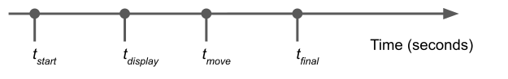
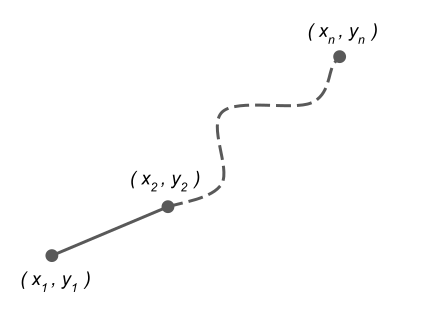
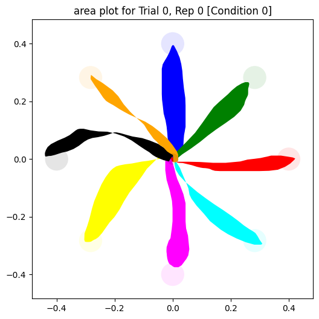
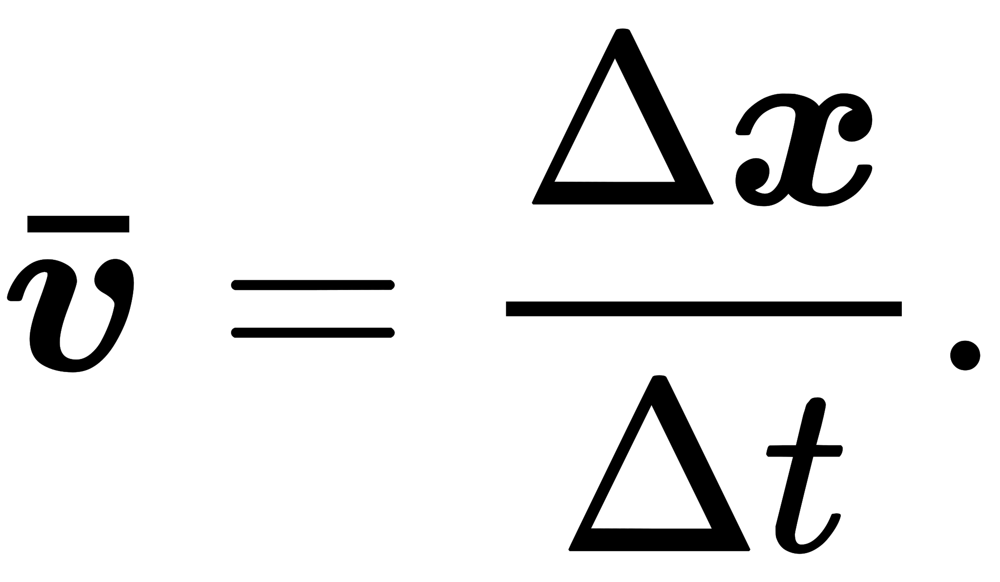
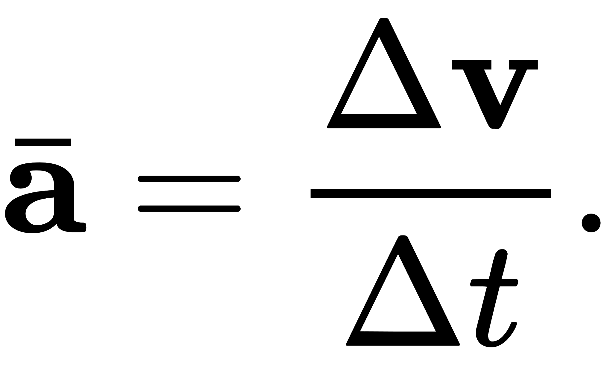

Statistics
==========

VSTT calculates a number of statistics for each trial.
These are displayed in the application, are provided in the statistics Pandas DataFrame,
and are also contained in the excel data export.
Here we provide the definitions used to calculate them.

Time
----

   The timepoints of events for a target.

The following timepoints are used to calculate timing statistics:

   * :math:`t_{start}` is when timestamps begin for this target
   * :math:`t_{display}` is when the target is first displayed
   * :math:`t_{move}` is when the cursor is first moved
   * :math:`t_{final}` is when the cursor reaches the target or timeout occurs

The following timing statistics are calculated, all in units of seconds:

   * Time
      * :math:`t_{final} - t_{display}`
      * Time from target being displayed to the target being reached by the cursor or timeout
   * Reaction time
      * :math:`t_{move} - t_{display}`
      * Time from target being displayed to first cursor movement
   * Movement time
      * :math:`t_{final} - t_{move}`
      * Time from first cursor movement to the target being reached by the cursor or timeout

Distance
--------

   The cursor positions for a target.

The cursor location at a timestamp is given by a pair of :math:`(x, y)` coordinates,
where :math:`(0, 0)` corresponds to the center of the screen,
and 1 in these units is equal to the height of the screen.

Given :math:`n` pairs of :math:`(x, y)` cursor locations, labelled in order from :math:`1` to :math:`n`,
the following statistics are calculated, all in units of screen height:

   * Distance
      * :math:`\sum_{i=1}^{n-1}\sqrt{(x_{i+1}-x_i)^2+(y_{i+1}-y_i)^2}`
      * Euclidean point-to-point distance travelled by the cursor

   * RMSE
      * :math:`\sqrt{\frac{\sum_{i=2}^{n}\left[(x_t-x_1)(y_1-y_i)-(x_1-x_i)(y_t-y_1)\right]^2}{(n-1)\left[(x_t-x_1)^2+(y_t-y_1)^2\right]}}`
      * where :math:`(x_t, y_t)` is the location of the target
      * Root Mean Square Error (RMSE) from the ideal path to the target
      * this is the RMS of the perpendicular distance of each cursor point from the ideal path
      * where the ideal path is the straight line from the first cursor point to the target
      * based on `Distance from a point to a line: Line defined by two points <https://en.wikipedia.org/wiki/Distance_from_a_point_to_a_line#Line_defined_by_two_points>`_

Area
----

The cursor location at a timestamp is given by a pair of :math:`(x, y)` coordinates,
where :math:`(0, 0)` corresponds to the center of the screen, and 1 in these units is equal to the height of the screen.

Given pairs of :math:`(x, y)` cursor locations, the following statistics are calculated, all in units of screen height:

    * Area
        * get the cursor coordinates of the polygon which is closed by the to target and to center :math:`(x, y)` cursor locations, use the build-in function to calculate the area of the polygon.
        * In cases where the cursor movement results in intersecting paths, multiple polygons are formed, and their areas are summed.
        * Moreover, when the movement not only intersects but also leads to overlapping regions, the overlapped area is counted twice.
        * e.g.
        * .. figure:: images/overlapping.svg

    * Normalized Area
        * (the area formed by paths) / (length of the paths)²

Velocity
--------

The cursor location at a timestamp is given by a pair of :math:`(x, y)` coordinates,
where :math:`(0, 0)` corresponds to the center of the screen, and 1 in these units is equal to the height of the screen per second.

Given pairs of :math:`(x, y)` cursor locations, and pairs of :math:`t` timestamp, the following statistics are calculated, all in units of screen height per second:

    * Velocity
        * :math:`\frac{\sqrt{(x_{i+1}-x_i)^2+(y_{i+1}-y_i)^2}}{t_{i+1}-t_i}`
        * the rate of change of position with respect to time

    * Peak Velocity
        * maximum velocity

Acceleration
-----------

The cursor location at a timestamp is given by a pair of :math:`(x, y)` coordinates,
where :math:`(0, 0)` corresponds to the center of the screen, and 1 in these units is equal to the screen height per second squared.

Given pairs of :math:`(x, y)` cursor locations, and pairs of :math:`t` timestamp, the following statistics are calculated, all in units of screen height per second squared:

    * Acceleration
        * :math:`\frac{\sqrt{(\frac{x_{i+2}-x_{i+1}}{t_{i+2}-t_{i+1}}-\frac{x_{i+1}-x_{i}}{t_{i+1}-t_{i}})^2+(\frac{y_{i+2}-y_{i+1}}{t_{i+2}-t_{i+1}}-\frac{y_{i+1}-y_{i}}{t_{i+1}-t_{i}})^2}}{t_{i+1}-t_i}`
        * the rate of change of the velocity of an object with respect to time

    * Peak Acceleration
        * maximum Acceleration

Spatial Error
-------------

.. figure:: images/spatial_error.svg
   :alt: Spatial Error is the distance from movement end point and the center of the target minus target' radius

The cursor location at a timestamp is given by a pair of :math:`(x, y)` coordinates,
where :math:`(0, 0)` corresponds to the center of the screen, and 1 in these units is equal to the screen height.

Given pairs of :math:`(x, y)` cursor locations,the following statistics are calculated, all in units of screen height:

    * Spatial Error to target
        * the distance between the end point of the movement to the center of the target - radius of target

    * Spatial Error to central target
        * the distance between the end point of the movement to the center of the central target - radius of central target
