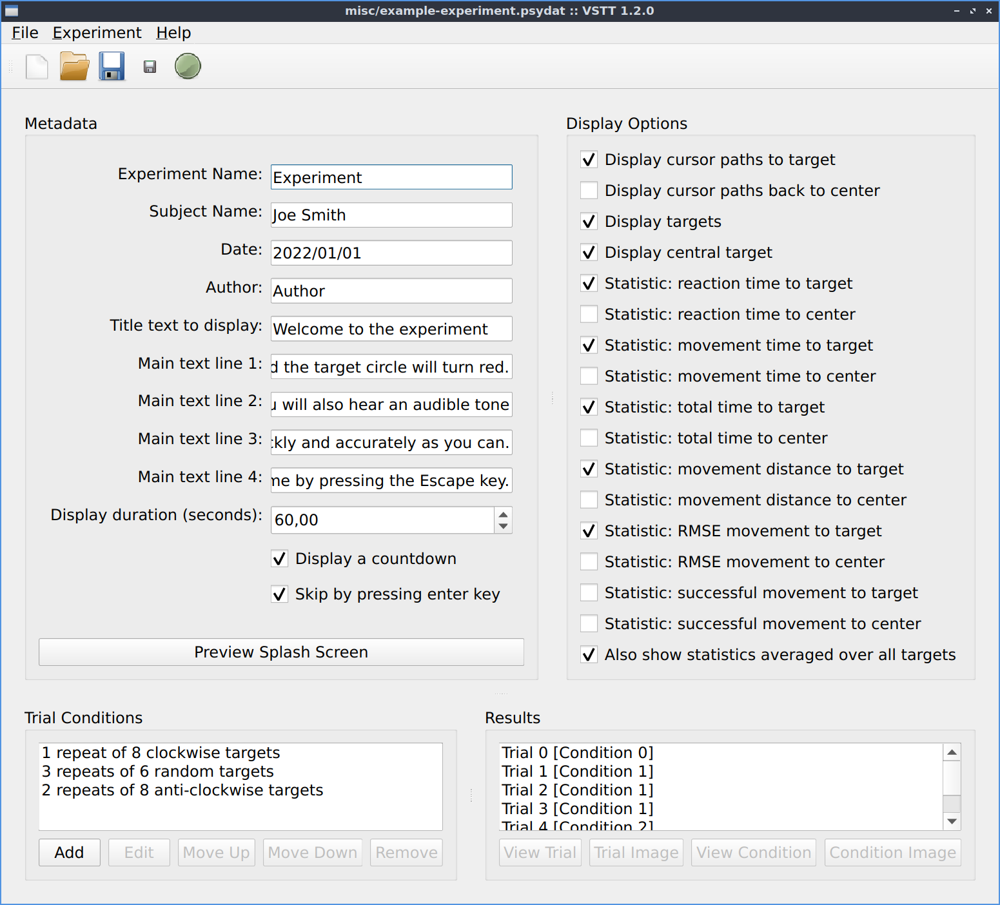
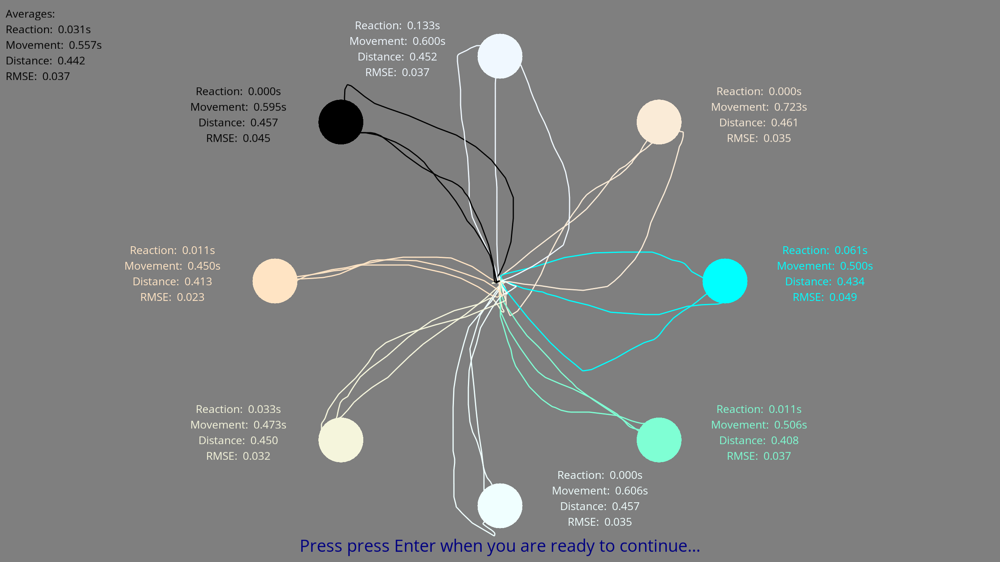

# Summary

Visuomotor Serial Targetting Task (VSTT) is an open source Python GUI tool
for designing, running and analyzing motor skill acquisition experiments.

TODO: more summary here

...

# Statement of need

TODO: more summary here

...

# Implementation

TODO: describe what the software does

TODO: more description

VSTT is cross-platform, and uses PyQt for the graphical user interface, and the Psychopy [@Peirce2019] library to construct and execute the experiments.
It is published on the Python Package Index and can be easily installed using pip.
In addition we offer a windows installer for users who may be less familiar with installing Python packages.

# Acknowledgments

Liam Keegan is employed by the Scientific Software Center of Heidelberg University
which is funded as part of the Excellence Strategy of the German Federal and State Governments.
